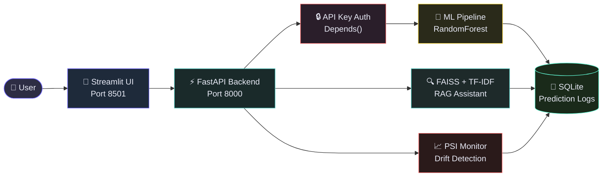

# ChurnPilot AI

> Production-ready ML platform for telecom customer churn prediction — FastAPI backend, async batch scoring, PSI drift monitoring, RAG-powered assistant, and a Streamlit dashboard. Deployed on AWS EC2 via Docker.

[](https://python.org)
[](https://fastapi.tiangolo.com)
[](https://scikit-learn.org)
[](https://docker.com)
[](tests/)

---

## 📺 Live Demo

| Service | URL |
|---|---|
| Streamlit UI | https://churnpilotai.streamlit.app/ |
| API Swagger Docs | http://3.142.131.45:8000/docs |
| Health Check | http://3.142.131.45:8000/health |

Note:
- The backend is also hosted on AWS EC2.
- To control costs, the EC2 instance may not be running 24/7.
- The Streamlit Assistant feature is passcode-protected. Contact me for access.

---

## System Architecture



> **→ Want the full visual walkthrough?** Enable [GitHub Pages](https://docs.github.com/en/pages/getting-started-with-github-pages/configuring-a-publishing-source-for-github-pages) on this repo and visit `https://danimanas.github.io/churnpilot-ai/docs/project_flow.html`

---

## What It Does

ChurnPilot AI predicts which telecom customers are likely to cancel their service. It exposes a REST API with five capabilities:

- **Single prediction** — score one customer in real time
- **Async batch scoring** — upload a CSV, get a scored file back when ready
- **Drift monitoring** — detect when live traffic diverges from training data (PSI)
- **RAG assistant** — ask questions about the model and its decisions
- **Streamlit dashboard** — a full UI wrapping all of the above

---

## Features

| Feature | Details |
|---|---|
| Inference | sklearn RandomForest pipeline, sub-millisecond, fully local |
| Batch scoring | Async background thread, job status polling, CSV download |
| Drift detection | PSI (Population Stability Index) over a rolling 7-day window |
| RAG assistant | FAISS + TF-IDF, offline, no paid API needed |
| Auth | Stateless API key via `X-API-Key` header |
| Frontend | Streamlit + Plotly (gauge, bar, and line charts) |
| Testing | 41 pytest tests, all passing, `/tmp` DB isolation |
| Deployment | Docker multi-stage build, AWS EC2, Docker Hub |

---

## Tech Stack

| Layer | Technology |
|---|---|
| API | FastAPI, Uvicorn, Pydantic v2 |
| ML | scikit-learn (RandomForest Pipeline), pandas, numpy |
| Database | SQLAlchemy + SQLite |
| RAG | FAISS flat L2 index + TF-IDF/TruncatedSVD (offline) |
| Frontend | Streamlit + Plotly |
| Testing | pytest (41 tests) |
| Deployment | Docker, AWS EC2 |

---

## Model Performance

Trained on the IBM Telco Customer Churn dataset (7,043 customers). Tuned for **high recall** — catching real churners matters more than avoiding false alarms.

| Metric | Value |
|---|---|
| ROC-AUC | 0.8428 |
| Churn Recall | 0.74 |
| Churn Precision | 0.55 |
| Overall Accuracy | 0.77 |

---

## API Endpoints

| Method | Endpoint | Auth | Description |
|---|---|---|---|
| GET | `/health` | Public | System health, uptime, FAISS status |
| POST | `/predict` | ✅ | Single customer churn prediction |
| POST | `/batch` | ✅ | Submit CSV for async batch scoring |
| GET | `/batch/{job_id}` | ✅ | Poll batch job status |
| GET | `/batch/{job_id}/download` | ✅ | Download scored CSV |
| GET | `/monitor` | ✅ | PSI drift report + daily churn trend |
| POST | `/assist` | ✅ | RAG knowledge assistant |

All protected endpoints require: `X-API-Key: dev-key-123`

---

## Local Quickstart

```bash
# 1. Enter the project
cd ml-ai-platform

# 2. Create and activate virtual environment
python -m venv .venv
source .venv/bin/activate        # Mac/Linux
# .venv\Scripts\activate         # Windows

# 3. Install dependencies
pip install -r requirements.txt
pip install streamlit plotly

# 4. Train the model
python ml/train.py

# 5. Build the RAG knowledge base index
python scripts/build_index.py

# 6. Copy environment config
cp .env.example .env             # edit VALID_API_KEYS if needed

# 7. Start the API (terminal 1)
uvicorn app.main:app --reload

# 8. Start the Streamlit UI (terminal 2)
streamlit run streamlit_app.py
```

Open:
- Streamlit UI → http://localhost:8501
- Swagger docs → http://localhost:8000/docs
- API key for testing: `dev-key-123`

---

## Assistant Access

In order to ask questions to the Assistant about churn prediction, the user needs a passcode.

Please contact me for the passcode.

---

## Running Tests

```bash
python -m pytest tests/ -v -p no:cacheprovider
# 41 tests — all passing
```

---

## Docker (Local)

```bash
docker compose up --build
# API → http://localhost:8000
```

---

## AWS EC2 Deployment

The platform runs two services on EC2: FastAPI on port 8000 and Streamlit on port 8501. Both ports must be open in the EC2 Security Group.

### Required Security Group Inbound Rules

| Type | Port | Source |
|---|---|---|
| Custom TCP | 8000 | 0.0.0.0/0 |
| Custom TCP | 8501 | 0.0.0.0/0 |

### Deploy Steps

```bash
# 1. SSH into your EC2 instance
ssh -i your-key.pem ec2-user@<your-ec2-ip>

# 2. Pull the Docker image
docker pull <your-dockerhub-username>/ml-ai-platform:latest

# 3. Start the FastAPI backend
docker run -d \
  --name ml-api \
  -p 8000:8000 \
  -e VALID_API_KEYS=dev-key-123 \
  <your-dockerhub-username>/ml-ai-platform:latest

# 4. Install and start Streamlit
pip install streamlit plotly requests

# Run in foreground
streamlit run streamlit_app.py --server.port 8501 --server.address 0.0.0.0

# Or run in the background
nohup streamlit run streamlit_app.py \
  --server.port 8501 \
  --server.address 0.0.0.0 \
  > streamlit.log 2>&1 &
```

### Stop Services

```bash
# Stop the API
docker stop ml-api && docker rm ml-api

# Stop Streamlit
pkill -f streamlit
```

---

## Project Structure

```
ml-ai-platform/
├── app/
│   ├── main.py              # FastAPI entry point + lifespan
│   ├── config.py            # Settings from .env
│   ├── auth.py              # API key dependency
│   ├── routers/             # health, predict, batch, monitor, assist
│   ├── services/            # ml, batch, monitor, rag services
│   ├── models/              # SQLAlchemy DB models
│   └── schemas/             # Pydantic request/response schemas
├── ml/
│   ├── train.py             # Model training script
│   └── artifacts/           # model.pkl, scaler.pkl (gitignored)
├── scripts/
│   └── build_index.py       # Build FAISS + TF-IDF index
├── data/
│   ├── docs/                # RAG knowledge base documents
│   ├── faiss_index/         # Built index files (gitignored)
│   └── batch_results/       # Scored CSVs (gitignored)
├── tests/                   # 41 pytest tests
├── docs/
│   ├── project_flow.html    # Architecture diagram (GitHub Pages)
│   └── project_flow.pdf     # Architecture diagram (PDF)
├── streamlit_app.py         # Streamlit frontend
├── Dockerfile
├── docker-compose.yml
└── requirements.txt
```

---

## Notes

- `/predict` uses a local sklearn pipeline — no external API calls, no latency.
- `/assist` uses TF-IDF embeddings (fully offline). Set `LLM_PROVIDER=openai` in `.env` to enable GPT-4o-mini answers.
- Never commit your `.env` file. Use environment variables in production.
- On EC2, update `API_BASE` in `streamlit_app.py` to point to your EC2 IP.
- Streamlit must be started separately on EC2 — it is not included in the Docker container.
